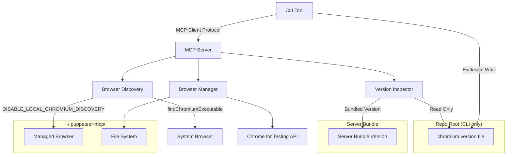

# Design Document

## Overview

The Chromium Auto-Management feature extends the Puppeteer MCP Server with automatic browser discovery, installation, and version management capabilities. The system consists of two main components: enhanced MCP server functionality and a separate CLI tool that communicates with the server via MCP protocol.

The design leverages the Chrome for Testing API for reliable browser downloads and productizes existing test utilities for browser discovery and management.

## Architecture

### Architectural Approach

This design follows the "functional core, imperative shell" pattern as specified in AGENTS.md:

- **Functional Core**: Pure functions handle all business logic, data transformations, and calculations
- **Imperative Shell**: Thin service wrappers handle I/O, side effects, and external integrations
- **Testability**: Pure functions are easily testable in isolation
- **Minimal Interfaces**: Simple parameter passing instead of request objects for 1-2 parameters

### High-Level Components



### Component Responsibilities

- **CLI Tool**: User interface for browser management, automatically starts and communicates with MCP server via MCP client protocol, and manages `chromium.version` file in project repositories locally (without MCP interactions)
- **Browser Discovery**: Locates available Chromium installations (system and managed), respects `DISABLE_LOCAL_CHROMIUM_DISCOVERY` environment variable for testing
- **Browser Manager**: Handles download, installation, and lifecycle management using Chrome for Testing API
- **Version Inspector**: Reads version requirements and performs compatibility checking (server reads bundled version, CLI manages project version files)
- **MCP Server**: Provides tools and resources for browser management via protocol, automatically discovers and connects to available Chromium instances

## Components and Interfaces

### 1. Enhanced MCP Server

#### New MCP Tools

```typescript
interface BrowserManagementTools {
  // Install specific browser version
  install_browser(request: InstallBrowserRequest): Promise<InstallBrowserResponse>;
}

interface InstallBrowserRequest {
  version?: string;
}

interface InstallBrowserResponse {
  success: boolean;
  version: string;
  path: string;
  error?: string;
}
```

#### New MCP Resources

```typescript
interface BrowserStatusResource {
  uri: "browser://status";
  mimeType: "application/json";
  content: BrowserStatusContent;
}

interface BrowserVersionsResource {
  uri: "browser://versions";
  mimeType: "application/json";
  content: BrowserVersionsContent;
}

interface BrowserStatusContent {
  installed: boolean;
  running: boolean;
  version?: string;
  source: 'system' | 'managed' | 'none';
  path?: string;
  versionRequirement?: string;
  compatible: boolean;
  nextSteps: BrowserNextStep[];
}

interface BrowserVersionsContent {
  versions: BrowserVersion[];
  current?: string;
  latest: string;
}

enum BrowserNextStep {
  INSTALL_BROWSER = 'install_browser',
  UPGRADE_BROWSER = 'upgrade_browser',
  NONE_REQUIRED = 'none_required'
}
```

### 2. Browser Discovery Service

Productizes existing test utilities for browser detection using functional core approach:

```typescript
// Pure functions (functional core)
export const discoverBrowsers = (): Promise<BrowserInstallation[]>;
export const findBestBrowser = (minVersion?: string, skipLocal?: boolean): Promise<BrowserInstallation | null>;
export const checkRunningBrowser = (port?: number): Promise<boolean>;

// Service wrapper (imperative shell)
interface BrowserDiscoveryService {
  discoverBrowsers(): Promise<BrowserInstallation[]>;
  findBestBrowser(minVersion?: string, skipLocal?: boolean): Promise<BrowserInstallation | null>;
  checkRunningBrowser(port?: number): Promise<boolean>;
}

class BrowserInstallation {
  constructor(
    public readonly path: string,
    public readonly version: string,
    public readonly source: 'system' | 'managed',
    public readonly verified: boolean = false
  ) {}

  // Launch this browser instance with remote debugging
  async launch(options?: LaunchOptions): Promise<Browser>;
  
  // Verify this installation can launch with remote debugging
  async verify(): Promise<boolean>;
  
  // Get browser executable info
  getExecutableInfo(): BrowserExecutableInfo;
  

}

interface LaunchOptions {
  headless?: boolean;
  debugPort?: number;
}

interface BrowserExecutableInfo {
  path: string;
  version: string;
}
```

### 3. Browser Manager Service

Handles Chromium installation and lifecycle using functional core approach:

```typescript
// Pure functions (functional core)
export const installChromium = (version?: string): Promise<InstallationResult>;
export const cleanupOldVersions = (): Promise<string[]>;
export const createInstallation = (path: string): Promise<BrowserInstallation>;

// Service wrapper (imperative shell)
interface BrowserManagerService {
  installChromium(version?: string): Promise<InstallationResult>;
  cleanupOldVersions(): Promise<string[]>;
  createInstallation(path: string): Promise<BrowserInstallation>;
}

interface InstallationResult {
  success: boolean;
  version: string;
  path: string;
  error?: string;
}
```

### 4. Version Inspector Service

Manages version requirements and compatibility using functional core approach:

```typescript
// Pure functions (functional core)
export const getVersionRequirement = (projectPath?: string): Promise<string | null>;
export const checkCompatibility = (installed: string, required?: string): Promise<VersionCompatibility>;
export const getAvailableVersions = (): Promise<BrowserVersion[]>;

// CLI-only pure functions
export const updateExpectedVersionFile = (version: string, projectPath: string): Promise<{ success: boolean; path: string }>;
export const isInRepoRoot = (): Promise<boolean>;

// Service wrapper (imperative shell)
interface VersionInspectorService {
  getVersionRequirement(projectPath?: string): Promise<string | null>;
  checkCompatibility(installed: string, required?: string): Promise<VersionCompatibility>;
  getAvailableVersions(): Promise<BrowserVersion[]>;
}

// CLI service wrapper (imperative shell)
interface CLIVersionManager {
  updateExpectedVersionFile(version: string, projectPath: string): Promise<{ success: boolean; path: string }>;
  isInRepoRoot(): Promise<boolean>;
}

interface VersionCompatibility {
  compatible: boolean;
  installedVersion: string;
  requiredVersion?: string;
  recommendation?: 'upgrade' | 'downgrade' | 'ok';
}
```

### 5. CLI Tool

Separate executable using functional core approach:

```typescript
// Pure functions (functional core)
export const listVersions = (): Promise<{ displayed: boolean; selectedVersion?: string }>;
export const installBrowser = (version?: string, forceLatest?: boolean): Promise<InstallResult>;
export const updateExpectedVersion = (version?: string, forceLatest?: boolean, projectPath?: string): Promise<{ success: boolean; version: string; filePath: string; error?: string }>;
export const showHelp = (): Promise<void>;
export const runInteractive = (): Promise<void>;

// CLI wrapper (imperative shell)
interface CLICommands {
  list(): Promise<{ displayed: boolean; selectedVersion?: string }>;
  install(version?: string, forceLatest?: boolean): Promise<InstallResult>;
  updateExpectedVersion(version?: string, forceLatest?: boolean, projectPath?: string): Promise<{ success: boolean; version: string; filePath: string; error?: string }>;
  help(): Promise<void>;
  interactive(): Promise<void>;
}

interface InstallResult {
  success: boolean;
  version: string;
  path?: string;
  error?: string;
}
```

## Data Models

### Chrome for Testing API Integration

The system uses Chrome for Testing API for reliable browser downloads on macOS and Linux. Windows support may be added in future iterations.

```typescript
interface BrowserVersion {
  kind: 'chromium'; // Only supported value currently
  version: string;
  revision: string;
  downloads: {
    chrome?: {
      linux64?: string; // Download URL
      mac_x64?: string; // Download URL
      mac_arm64?: string; // Download URL
      win32?: string; // Download URL (future support)
      win64?: string; // Download URL (future support)
    };
    chromedriver?: {
      linux64?: string; // Download URL
      mac_x64?: string; // Download URL
      mac_arm64?: string; // Download URL
      win32?: string; // Download URL (future support)
      win64?: string; // Download URL (future support)
    };
  };
}
```

### Configuration Model

```typescript
interface ChromiumConfig {
  // Installation preferences
  installPath: string; // Base directory: ~/.puppeteer-mcp/chromium/ (contains version subdirectories)
  
  // Discovery options
  skipLocalDiscovery: boolean; // From DISABLE_LOCAL_CHROMIUM_DISCOVERY
  debugPort: number;
}

// Example directory structure:
// ~/.puppeteer-mcp/chromium/
//   ├── 120.0.6099.109/
//   │   └── chrome (executable)
//   └── 121.0.6167.85/
//       └── chrome (executable)
```

## Error Handling

### Browser Unavailable Scenarios

1. **No Chromium Found**: Return helpful error with installation guidance
2. **Version Incompatible**: Warn but continue with available version
3. **Download Failed**: Provide fallback options and retry mechanisms
4. **Launch Failed**: Detailed diagnostics and troubleshooting steps

### Error Response Format

```typescript
interface BrowserError {
  code: 'BROWSER_NOT_FOUND' | 'VERSION_INCOMPATIBLE' | 'DOWNLOAD_FAILED' | 'LAUNCH_FAILED';
  message: string;
  details?: string;
  suggestions: string[];
  canRetry: boolean;
}
```

## Testing Strategy

### Unit Testing

- **Browser Discovery**: Mock file system and command execution
- **Version Management**: Test version parsing and compatibility logic
- **Download Manager**: Mock HTTP requests and file operations
- **CLI Interface**: Test argument parsing and MCP client communication

### Integration Testing

- **End-to-End Installation**: Test complete download and installation flow
- **Browser Launch**: Verify installed browsers can launch with remote debugging
- **Version File Management**: Test reading/writing chromium.version files
- **MCP Protocol**: Test CLI-to-server communication

### Test Environment Controls

- Use `DISABLE_LOCAL_CHROMIUM_DISCOVERY=1` to test managed installation paths
- Mock Chrome for Testing API responses for offline testing
- Temporary installation directories for test isolation

## Implementation Phases

### Phase 1: Core Infrastructure
- Extract and refactor existing test utilities (`findChromiumExecutable()`) into shared modules
- Implement Browser Discovery Service with `DISABLE_LOCAL_CHROMIUM_DISCOVERY` support
- Add basic MCP tools for browser status

### Phase 2: Installation Management
- Implement Chrome for Testing API integration (macOS and Linux initially)
- Add Browser Manager Service with download capabilities
- Create managed installation directory structure (`~/.puppeteer-mcp/chromium/`)

### Phase 3: Version Management
- Implement Version Inspector Service with server/CLI separation of concerns
- Add chromium.version file support (CLI manages, server reads bundled version)
- Integrate version compatibility checking

### Phase 4: CLI Tool
- Create separate CLI executable with command shortcuts (`l`, `i`, `u`, `help`)
- Implement MCP client protocol communication (CLI auto-starts server)
- Add Clack-based interactive UI with `--force-latest`/`-f` flag support

### Phase 5: Integration & Polish
- Integrate all components with existing MCP server auto-discovery
- Add comprehensive error handling and installation guidance
- Implement cleanup and maintenance features

## Security Considerations

### Download Security
- Use HTTPS for all API communications
- Validate downloaded binaries before installation

### File System Security
- Restrict managed installation to user home directory
- Clean up temporary files during installation

### Process Security
- Use isolated user data directories
- Bind debug port only to localhost

## Performance Considerations

### Startup Performance
- Cache browser discovery results
- Lazy-load Chrome for Testing API data

### Download Performance
- Stream large downloads to disk
- Clean up temporary extraction directories