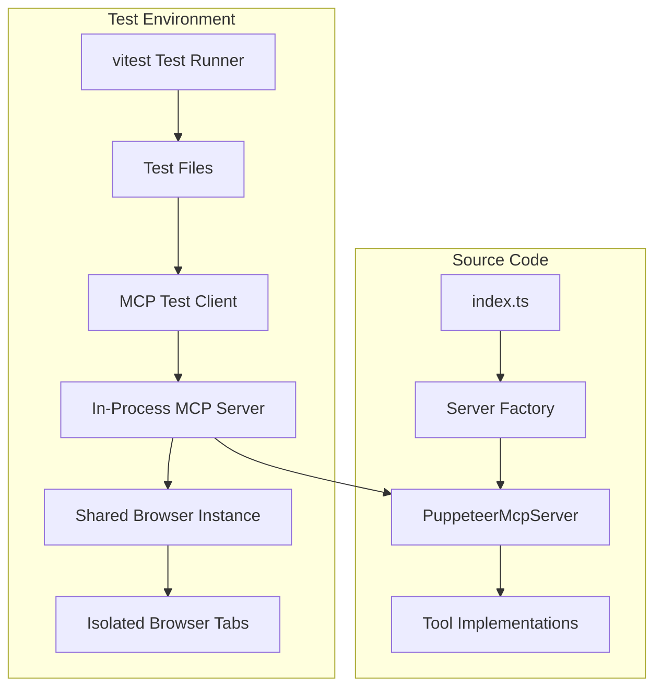

# Design Document

## Overview

This design outlines the migration from bash-based testing to a modern TypeScript testing infrastructure using vitest. The solution provides in-process testing capabilities, better debugging support, and comprehensive coverage of all MCP server tools while maintaining the existing public API.

**Implementation Status**: ✅ **COMPLETE** - 91.83% test coverage with 201 passing tests across 19 test files. All requirements fully satisfied with robust test infrastructure including comprehensive error path coverage, parallel execution, and extensive test utilities testing.

## Architecture

### Testing Framework Architecture



### Test Isolation Strategy

Each test will:
1. Create its own MCP server instance
2. Use a dedicated browser tab from a per-file browser instance (evolved from shared browser for better parallel execution)
3. Have isolated session state and console logs
4. Clean up resources after completion with comprehensive error handling

## Components and Interfaces

### 1. Test Configuration (`vitest.config.ts`)

```typescript
export default defineConfig({
  test: {
    environment: 'node',
    globals: true,
    setupFiles: ['./src/test-utils/test-setup.ts'],
    testTimeout: 30000, // Allow time for browser operations
    hookTimeout: 5_000,
    teardownTimeout: 5_000
  },
  include: ['src/**/_tests/**/*.test.ts'],
  exclude: ['node_modules', 'dist', 'src/**/_tests/**/test-resources/**']
});
```

### 2. Test Setup and Browser Management (`src/test-utils/test-setup.ts`)

```typescript
import { Browser } from 'puppeteer-core';
import { initBrowser } from '../initBrowser.js';

// Per-file browser instances for better parallel execution
const browserInstances = new Map<string, Browser>();

export async function getTestBrowser(): Promise<Browser> {
  const testFile = expect.getState().testPath || 'default';
  
  if (!browserInstances.has(testFile)) {
    const browser = await initBrowser({
      headless: !shouldShowBrowser(),
      userDataDir: `/tmp/chromium-test-profile-${Date.now()}-${Math.random().toString(36).substring(2, 8)}`
    });
    browserInstances.set(testFile, browser);
  }
  
  return browserInstances.get(testFile)!;
}

export async function cleanupTestBrowser(): Promise<void> {
  // Comprehensive cleanup with error handling and process termination
  // Implementation includes force cleanup and profile directory removal
}
```

### 3. MCP Test Client Wrapper (`src/test-utils/McpTestClient.ts`)

```typescript
import { Client } from '@modelcontextprotocol/sdk/client/index.js';
import { StdioClientTransport } from '@modelcontextprotocol/sdk/client/stdio.js';
import { PuppeteerMcpServer } from '../PuppeteerMcpServer.js';

export class McpTestClient {
  private client: Client;
  private server: PuppeteerMcpServer;
  private transport: TestTransport;

  constructor(server: PuppeteerMcpServer) {
    this.server = server;
    this.transport = new TestTransport();
    this.client = new Client({
      name: 'test-client',
      version: '1.0.0'
    }, {
      capabilities: {}
    });
  }

  async initialize(): Promise<void> {
    await this.server.connect(this.transport);
    await this.client.connect(this.transport);
  }

  async callTool(name: string, arguments_: Record<string, unknown>) {
    return await this.client.callTool({ name, arguments: arguments_ });
  }

  async listTools() {
    return await this.client.listTools();
  }

  async disconnect(): Promise<void> {
    await this.server.disconnect();
    await this.client.close();
  }
}
```

### 4. Local Test Web Server (`src/test-utils/TestWebServer.ts`)

```typescript
import { createServer, IncomingMessage, ServerResponse } from 'http';
import { readFile } from 'fs/promises';
import { join, dirname } from 'path';

export interface TestResource {
  path: string;
  body?: string;
  bodySourcePath?: string;
  contentType: string;
}

export class TestWebServer {
  private server: ReturnType<typeof createServer>;
  private port: number = 0;
  private resources: Map<string, TestResource> = new Map();

  constructor(private testDir: string) {
    this.server = createServer(this.handleRequest.bind(this));
  }

  async start(): Promise<number> {
    return new Promise((resolve, reject) => {
      this.server.listen(0, 'localhost', () => {
        const address = this.server.address();
        if (address && typeof address === 'object') {
          this.port = address.port;
          resolve(this.port);
        } else {
          reject(new Error('Failed to get server port'));
        }
      });
    });
  }

  addResource(resource: TestResource): void {
    this.resources.set(resource.path, resource);
  }

  addResources(resources: TestResource[]): void {
    resources.forEach(resource => this.addResource(resource));
  }

  getUrl(path: string = '/'): string {
    return `http://localhost:${this.port}${path}`;
  }

  private async handleRequest(req: IncomingMessage, res: ServerResponse): Promise<void> {
    const url = req.url || '/';
    const resource = this.resources.get(url);

    if (!resource) {
      res.writeHead(404);
      res.end('Not Found');
      return;
    }

    try {
      let body: string;
      if (resource.body) {
        body = resource.body;
      } else if (resource.bodySourcePath) {
        const fullPath = join(this.testDir, resource.bodySourcePath);
        body = await readFile(fullPath, 'utf-8');
      } else {
        res.writeHead(400); // this is a client request error!
        res.end('No body or bodySourcePath specified');
        return;
      }

      res.writeHead(200, { 'Content-Type': resource.contentType });
      res.end(body);
    } catch (error) {
      res.writeHead(500);
      res.end(`Internal Server Error: ${error?.message ?? error?.toString() ?? 'unknown error'}`);
    }
  }

  async stop(): Promise<void> {
    return new Promise((resolve) => this.server.close(resolve));
  }
}
```

### 5. In-Memory Transport for Testing (`src/test-utils/TestTransport.ts`)

```typescript
import { Transport } from '@modelcontextprotocol/sdk/shared/transport.js';

export class TestTransport implements Transport {
  private serverToClientMessages: JSONRPCMessage[] = [];
  private clientToServerMessages: JSONRPCMessage[] = [];
  private isServerSide: boolean;
  private closed: boolean = false;
  private connectedTransport?: TestTransport;
  private started: boolean = false;
  private sessionId: string;

  constructor(isServerSide: boolean = false, sessionId?: string) {
    this.isServerSide = isServerSide;
    this.sessionId = sessionId || `test-session-${Date.now()}-${Math.random().toString(36).substring(2, 11)}`;
  }

  // Bidirectional message routing with proper session isolation
  connect(otherTransport: TestTransport): void {
    this.connectedTransport = otherTransport;
    otherTransport.connectedTransport = this;
  }

  // Message history tracking for debugging
  getServerToClientMessages(): JSONRPCMessage[] { /* ... */ }
  getClientToServerMessages(): JSONRPCMessage[] { /* ... */ }
  clearMessageHistory(): void { /* ... */ }
}

export function createTransportPair(sessionId?: string): { 
  clientTransport: TestTransport; 
  serverTransport: TestTransport 
} {
  const clientTransport = new TestTransport(false, sessionId);
  const serverTransport = new TestTransport(true, sessionId);
  clientTransport.connect(serverTransport);
  return { clientTransport, serverTransport };
}
```

### 5. TypeScript API Types (`src/types/api.ts`)

```typescript
// Import MCP SDK types for protocol compliance
import { 
  CallToolResult, 
  TextContent, 
  ImageContent 
} from '@modelcontextprotocol/sdk/types.js';

// Tool-specific request types (parameters passed to tools)

/**
 * Request parameters for the navigate tool
 */
export interface NavigateRequest {
  /** The URL to navigate to, must be a valid HTTP/HTTPS URL */
  url: string;
}

/**
 * Request parameters for the click tool
 */
export interface ClickRequest {
  /** CSS selector of the element to click */
  selector: string;
}

/**
 * Request parameters for the get_console tool
 */
export interface GetConsoleRequest {
  /** Whether to clear the console logs after retrieving them */
  clear?: boolean;
}

// Tool response types (extend MCP CallToolResult for protocol compliance)

/**
 * Response from the navigate tool
 */
export interface NavigateResponse extends CallToolResult {
  /** Array containing the response message */
  content: Array<TextContent>;
  /** Indicates whether the operation resulted in an error */
  isError: boolean;
}

/**
 * Response from the click tool
 */
export interface ClickResponse extends CallToolResult {
  /** Array containing the response message */
  content: Array<TextContent>;
  /** Indicates whether the operation resulted in an error */
  isError: boolean;
}

/**
 * Response from the take_screenshot tool
 */
export interface ScreenshotResponse extends CallToolResult {
  /** Array containing the base64-encoded PNG image data */
  content: Array<ImageContent>;
  /** Indicates whether the operation resulted in an error */
  isError: boolean;
}

/**
 * Response from the get_html tool
 */
export interface GetHtmlResponse extends CallToolResult {
  /** Array containing the HTML content of the current page */
  content: Array<TextContent>;
  /** Indicates whether the operation resulted in an error */
  isError: boolean;
}

/**
 * Response from the get_console tool
 */
export interface GetConsoleResponse extends CallToolResult {
  /** Array containing the console output */
  content: Array<TextContent>;
  /** Indicates whether the operation resulted in an error */
  isError: boolean;
}

/**
 * Response from the list_tab_urls tool
 */
export interface ListTabUrlsResponse extends CallToolResult {
  /** Array containing the comma-separated list of tab URLs */
  content: Array<TextContent>;
  /** Indicates whether the operation resulted in an error */
  isError: boolean;
}

// Union types for convenience
export type ToolRequest = NavigateRequest | ClickRequest | GetConsoleRequest;
export type ToolResponse = NavigateResponse | ClickResponse | ScreenshotResponse | GetHtmlResponse | GetConsoleResponse | ListTabUrlsResponse;
```

### 7. Test Context Factory (`src/test-utils/TestContext.ts`)

```typescript
export interface TestContextConfig {
  /** Descriptive label for the test (used to generate unique session ID) */
  testLabel: string;
  /** Browser instance to use (optional, will use shared browser if not provided) */
  browser?: Browser;
  /** Base directory for resolving relative paths in web resources (defaults to current working directory) */
  webResourcesBaseDir?: string;
}

export class TestContext {
  public readonly sessionId: string;
  public readonly browser: Browser;
  public readonly webResourcesBaseDir: string;

  private _client: McpTestClient;
  private _webServer: TestWebServer | null = null;

  constructor(config: InternalTestContextConfig) {
    this.sessionId = config.sessionId;
    this.browser = config.browser;
    this.webResourcesBaseDir = config.webResourcesBaseDir || process.cwd();
    this._client = config.client;
  }

  get client(): McpTestClient {
    return this._client;
  }

  get server(): PuppeteerMcpServer {
    return this.client.getServer();
  }

  get webServer(): TestWebServer {
    if (!this._webServer) {
      this._webServer = new TestWebServer(this.webResourcesBaseDir);
    }
    return this._webServer;
  }

  async cleanup(): Promise<void> {
    // Cleanup implementation with error handling
  }
}

export async function withTestContext<T>(
  testLabelOrConfig: string | TestContextConfig,
  testFn: (context: TestContext) => Promise<T>
): Promise<T> {
  const config: TestContextConfig = typeof testLabelOrConfig === 'string'
    ? { testLabel: testLabelOrConfig }
    : testLabelOrConfig;

  const context = await createTestContext(config);

  try {
    return await testFn(context);
  } finally {
    await context.cleanup();
  }
}
```

The test context factory provides:
- **Lazy Initialization**: Components are created only when needed
- **Session Isolation**: Each test gets a unique session ID
- **Automatic Cleanup**: Resources are cleaned up even if tests fail
- **Flexible Configuration**: Supports both simple string labels and full config objects
- **Type Safety**: Full TypeScript support with proper typing

### 8. Test Fixtures (`src/test-utils/test-fixtures.ts`)

```typescript
/**
 * Interactive HTML page with buttons, forms, and JavaScript for testing interactions
 */
export const interactiveHtml = `
<!DOCTYPE html>
<html>
<head>
    <title>Interactive Test Page</title>
    <style>
        body { font-family: Arial, sans-serif; padding: 20px; }
        button { margin: 10px; padding: 10px 20px; }
        .result { margin: 10px 0; padding: 10px; background: #f0f0f0; }
    </style>
</head>
<body>
    <h1>Interactive Test Page</h1>
    
    <button id="test-button" onclick="handleButtonClick()">Click Me</button>
    <button id="console-button" onclick="logToConsole()">Log to Console</button>
    <button id="error-button" onclick="throwError()">Throw Error</button>
    
    <div id="result" class="result">No actions performed yet</div>
    
    <form id="test-form" onsubmit="handleFormSubmit(event)">
        <input type="text" id="text-input" placeholder="Enter text" />
        <button type="submit">Submit Form</button>
    </form>
    
    <a href="/page2" id="navigation-link">Navigate to Page 2</a>
    
    <script>
        // Interactive JavaScript for testing browser automation
        let clickCount = 0;
        
        function handleButtonClick() {
            clickCount++;
            document.getElementById('result').textContent = \`Button clicked \${clickCount} times\`;
            console.log(\`Button clicked \${clickCount} times\`);
        }
        
        function logToConsole() {
            console.log('Test log message');
            console.warn('Test warning message');
            console.error('Test error message');
            document.getElementById('result').textContent = 'Check console for log messages';
        }
        
        function throwError() {
            console.error('Intentional test error');
            throw new Error('This is a test error');
        }
        
        function handleFormSubmit(event) {
            event.preventDefault();
            const input = document.getElementById('text-input');
            document.getElementById('result').textContent = \`Form submitted with: \${input.value}\`;
            console.log(\`Form submitted with: \${input.value}\`);
        }
    </script>
</body>
</html>\`;

/**
 * Second page for navigation testing
 */
export const page2Html = `
<!DOCTYPE html>
<html>
<head>
    <title>Page 2</title>
</head>
<body>
    <h1>Page 2</h1>
    <p>This is the second page for navigation testing.</p>
    <a href="/" id="back-link">Back to Page 1</a>
    <script>
        console.log('Page 2 loaded');
    </script>
</body>
</html>\`;
```

**Test Fixtures Guidelines:**
- **Dynamic Fixtures**: Uses TypeScript constants in `test-fixtures.ts` instead of static HTML files for better maintainability
- **Reusability**: All shareable HTML fixtures, test data, and common test scenarios are defined in `test-fixtures.ts`
- **Consistency**: Tests reuse existing fixtures rather than creating inline HTML strings
- **Maintainability**: When adding new test scenarios, existing fixtures can be extended or new reusable fixtures created
- **Documentation**: Each fixture has clear JSDoc comments explaining its purpose and key interactive elements
- **Interactive Elements**: Fixtures include relevant interactive elements (buttons, forms, links) with proper IDs for easy testing
- **Console Integration**: Fixtures include JavaScript that logs to console for testing console capture functionality
- **Type Safety**: All fixtures are TypeScript constants with proper typing and IDE support

**Usage Example:**
```typescript
import { interactiveHtml, page2Html } from '../test-fixtures.js';

await withTestContext('button-interaction-test', async (context) => {
  await context.webServer.addResource({
    path: '/',
    body: interactiveHtml,
    contentType: 'text/html'
  });
  
  await context.client.navigate(context.webServer.getUrl('/'));
  await context.client.click('#test-button');
  
  const html = await context.client.getHtml();
  expect(html.content[0].text).toContain('Button clicked 1 times');
});
```

## File Naming Style Guide

This project follows a consistent file naming convention where TypeScript files are named after their primary export:

### Style Guide Rules

- **Primary Export Rule**: TypeScript files must be named after their primary export
- **Class Files**: Use PascalCase matching the class name (`PuppeteerMcpServer.ts` exports `PuppeteerMcpServer`)
- **Function Files**: Use camelCase matching the primary function (`initBrowser.ts` exports `initBrowser`)
- **Index Files**: Use `index.ts` for re-export files and main entry points
- **Multi-export Files**: Use descriptive names for files with multiple related exports (e.g., `test-helpers.ts`)
- **Test Files**: Named after the class/module they test (e.g., `McpTestClient.test.ts` tests `McpTestClient`)
- **Import Extensions**: Include `.ts` extensions in imports (required for ESNext modules)

### Examples

```typescript
// ✅ Correct naming
src/PuppeteerMcpServer.ts     // exports class PuppeteerMcpServer
src/initBrowser.ts            // exports function initBrowser
src/test-utils/McpTestClient.ts // exports class McpTestClient
src/test-utils/TestContext.ts   // exports class TestContext

// ✅ Appropriate descriptive names
src/test-utils/test-helpers.ts  // multiple utility functions
src/test-utils/test-fixtures.ts // multiple constants/fixtures
src/types/api.ts               // multiple related API types

// ✅ Test file naming
src/test-utils/_tests/McpTestClient.test.ts    // tests McpTestClient class
src/test-utils/_tests/TestContext.test.ts     // tests TestContext class
```

## Data Models

### Test Suite Structure

```
src/
├── _tests/                         # Main test directory (actual implementation)
│   ├── navigate.test.ts            # Navigate tool tests
│   ├── click.test.ts               # Click tool tests
│   ├── screenshot.test.ts          # Screenshot tool tests
│   ├── html.test.ts                # HTML extraction tests
│   ├── console.test.ts             # Console tool tests
│   ├── list-tabs.test.ts           # Tab listing tests
│   ├── integration.test.ts         # Complex workflow integration tests
│   ├── error-paths.test.ts         # Error path coverage tests
│   └── initBrowser.test.ts         # Browser initialization tests
├── test-utils/                        # Comprehensive test infrastructure
│   ├── McpTestClient.ts            # MCP client wrapper (class McpTestClient)
│   ├── TestTransport.ts            # In-memory transport (class TestTransport)
│   ├── TestWebServer.ts            # Local web server (class TestWebServer)
│   ├── TestContext.ts              # Test context factory (class TestContext)
│   ├── test-setup.ts               # Global test setup utilities
│   ├── test-helpers.ts             # Common test helper functions
│   ├── test-fixtures.ts            # Reusable HTML fixtures and test data
│   ├── vitest-setup.ts             # Vitest global setup configuration
│   ├── global-setup.ts             # Global test environment setup
│   ├── index.ts                    # Test utilities re-exports
│   └── _tests/                     # **Comprehensive test utilities testing**
│       ├── McpTestClient.test.ts   # Tests for McpTestClient class (23 tests)
│       ├── TestContext.test.ts     # Tests for TestContext class (5 tests)
│       ├── TestTransport.test.ts   # Tests for TestTransport class (17 tests)
│       ├── TestWebServer.test.ts   # Tests for TestWebServer class (9 tests)
│       ├── test-fixtures.test.ts   # Tests for test fixtures (7 tests)
│       ├── test-helpers.test.ts    # Tests for test helper functions (14 tests)
│       ├── test-setup-core.test.ts # Core test setup functionality tests (15 tests)
│       ├── test-setup-lifecycle.test.ts # Test setup lifecycle tests (7 tests)
│       └── global-setup.test.ts    # Global setup testing (2 tests)
└── types/
    ├── api.ts                      # Public API type definitions
    ├── internal.ts                 # Internal type definitions
    └── index.ts                    # Type re-exports
```

### Test Data Models

```typescript
interface TestContext {
  client: McpTestClient;
  server: PuppeteerMcpServer;
  sessionId: string;
  browser: Browser;
  webServer?: TestWebServer;
}

interface ToolTestCase {
  name: string;
  description: string;
  resources?: TestResource[];
  setup?: (context: TestContext) => Promise<void>;
  execute: (context: TestContext) => Promise<void>;
  cleanup?: (context: TestContext) => Promise<void>;
}

interface IntegrationTestScenario {
  name: string;
  description: string;
  pages: TestResource[];
  steps: Array<{
    tool: string;
    parameters: Record<string, unknown>;
    expectedResult?: any;
    validation?: (result: any, context: TestContext) => Promise<void>;
  }>;
}
```

## Error Handling

### Test Error Categories

1. **Browser Connection Errors**: Handle cases where Chromium is not available
2. **Tool Execution Errors**: Validate error responses for invalid inputs
3. **Resource Cleanup Errors**: Ensure proper cleanup even when tests fail
4. **Timeout Errors**: Handle long-running browser operations
5. **Parallel Execution Errors**: Manage conflicts between concurrent tests

### Error Handling Strategy

```typescript
// Global error handler for tests
export async function withErrorHandling<T>(
  testFn: () => Promise<T>,
  cleanup?: () => Promise<void>
): Promise<T> {
  try {
    return await testFn();
  } catch (error) {
    if (cleanup) {
      try {
        await cleanup();
      } catch (cleanupError) {
        console.error('Cleanup failed:', cleanupError);
      }
    }
    throw error;
  }
}
```

## Testing Strategy

### Unit Tests
- Individual tool functionality
- Parameter validation (implicitly tested through tool calls)
- Error response handling
- Error path coverage for catch blocks

### Integration Tests
- Full MCP protocol communication
- Browser interaction workflows
- Session management
- Resource cleanup
- Main entry point testing (index.ts, initBrowser.ts)
- End-to-end server functionality

### Parallel Execution Tests
- Multiple concurrent tool calls
- Session isolation verification
- Resource contention handling

### Test Organization

```typescript
// Example test structure
describe('PuppeteerMcpServer', () => {
  describe('Tool: navigate', () => {
    it('should navigate to valid URLs', async () => {
      // Test implementation with local web server
    });
    
    it('should handle invalid URLs', async () => {
      // Error case testing
    });
  });
  
  describe('Error Path Coverage', () => {
    it('should handle tool execution failures', async () => {
      // Force error conditions to test catch blocks
    });
    
    it('should handle page cleanup failures', async () => {
      // Test disconnect method error handling
    });
  });
  
  describe('Session Management', () => {
    it('should isolate sessions', async () => {
      // Parallel execution testing
    });
  });
});

// Integration test example
describe('Integration Tests', () => {
  it('should handle complex multi-tool workflows', async () => {
    // 1. Start local web server with test pages
    // 2. Navigate to first page
    // 3. Click button that modifies page
    // 4. Take screenshot
    // 5. Click link to navigate to second page
    // 6. Extract HTML content
    // 7. Verify console output
    // 8. Cleanup
  });
  
  it('should test main entry points', async () => {
    // Test index.ts server startup
    // Test initBrowser.ts connection logic
    // Test end-to-end functionality
  });
});
```

### Performance Considerations

1. **Per-File Browser Instances**: Each test file gets its own browser instance for optimal parallel execution
2. **Tab Isolation**: Each test gets its own tab to prevent interference
3. **Session Isolation**: Unique session IDs and isolated browser contexts
4. **Comprehensive Cleanup**: Multi-layer cleanup with error handling and process termination
5. **Parallel Execution**: Up to 4 concurrent test threads with proper resource isolation
6. **Coverage Optimization**: 91.83% test coverage with 201 passing tests across 19 test files

### Test Infrastructure Quality Assurance

The implementation includes comprehensive testing of the test infrastructure itself:

- **Test Utilities Testing**: All test utility classes have their own test suites (99 tests total)
- **Coverage Validation**: Test utilities maintain 90%+ coverage to ensure reliability
- **Error Path Testing**: Test utilities include error handling and edge case coverage
- **Integration Validation**: Test utilities are tested both in isolation and integration
- **Lifecycle Testing**: Browser management, cleanup, and resource handling are thoroughly tested

This "testing the tests" approach ensures the test infrastructure is as reliable as the production code.

### Migration Strategy

1. **Phase 1**: ✅ Set up vitest configuration and basic test infrastructure
2. **Phase 2**: ✅ Create test utilities and MCP client wrapper
3. **Phase 3**: ✅ Implement individual tool tests
4. **Phase 4**: ✅ Add integration and parallel execution tests
5. **Phase 5**: ✅ Remove bash-based tests and update CI/CD
6. **Phase 6**: ✅ Comprehensive test utilities testing and error path coverage

### Compatibility Considerations

- Maintain Node.js 22+ compatibility
- Ensure TypeScript strict mode compliance
- Keep existing build process unchanged
- Preserve all current dependencies
- Maintain ESM module format