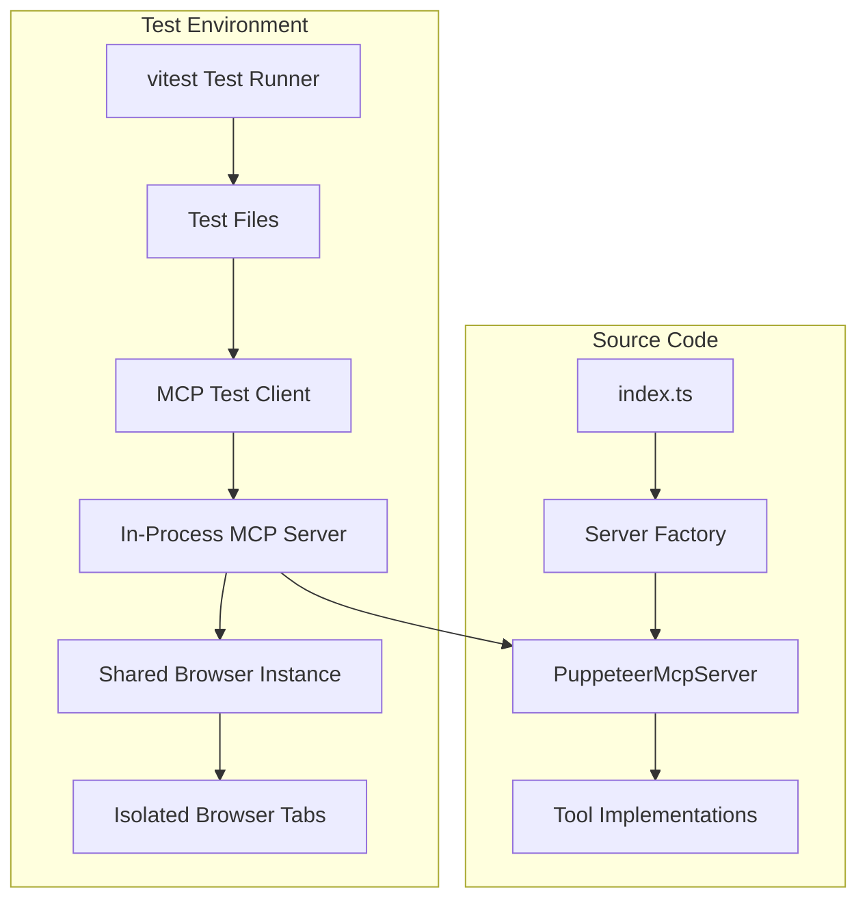

# Design Document

## Overview

This design outlines the migration from bash-based testing to a modern TypeScript testing infrastructure using vitest. The solution will provide in-process testing capabilities, better debugging support, and comprehensive coverage of all MCP server tools while maintaining the existing public API.

## Architecture

### Testing Framework Architecture



### Test Isolation Strategy

Each test will:
1. Create its own MCP server instance
2. Use a dedicated browser tab from a shared browser instance
3. Have isolated session state and console logs
4. Clean up resources after completion

## Components and Interfaces

### 1. Test Configuration (`vitest.config.ts`)

```typescript
export default defineConfig({
  test: {
    environment: 'node',
    globals: true,
    setupFiles: ['./src/test-utils/test-setup.ts'],
    testTimeout: 30000, // Allow time for browser operations
    hookTimeout: 5_000,
    teardownTimeout: 5_000
  },
  include: ['src/**/_tests/**/*.test.ts'],
  exclude: ['node_modules', 'dist', 'src/**/_tests/**/test-resources/**']
});
```

### 2. Test Setup and Browser Management (`src/test-utils/test-setup.ts`)

```typescript
import { Browser } from 'puppeteer-core';
import { initBrowser } from '../puppeteer.js';

let sharedBrowser: Browser | null = null;

export async function getTestBrowser(): Promise<Browser> {
  if (!sharedBrowser) {
    sharedBrowser = await initBrowser();
  }
  return sharedBrowser;
}

export async function cleanupTestBrowser(): Promise<void> {
  if (sharedBrowser) {
    await sharedBrowser.close();
    sharedBrowser = null;
  }
}
```

### 3. MCP Test Client Wrapper (`src/test-utils/mcp-test-client.ts`)

```typescript
import { Client } from '@modelcontextprotocol/sdk/client/index.js';
import { StdioClientTransport } from '@modelcontextprotocol/sdk/client/stdio.js';
import { PuppeteerMcpServer } from '../PuppeteerMcpServer.js';

export class McpTestClient {
  private client: Client;
  private server: PuppeteerMcpServer;
  private transport: TestTransport;

  constructor(server: PuppeteerMcpServer) {
    this.server = server;
    this.transport = new TestTransport();
    this.client = new Client({
      name: 'test-client',
      version: '1.0.0'
    }, {
      capabilities: {}
    });
  }

  async initialize(): Promise<void> {
    await this.server.connect(this.transport);
    await this.client.connect(this.transport);
  }

  async callTool(name: string, arguments_: Record<string, unknown>) {
    return await this.client.callTool({ name, arguments: arguments_ });
  }

  async listTools() {
    return await this.client.listTools();
  }

  async disconnect(): Promise<void> {
    await this.server.disconnect();
    await this.client.close();
  }
}
```

### 4. Local Test Web Server (`src/test-utils/test-web-server.ts`)

```typescript
import { createServer, IncomingMessage, ServerResponse } from 'http';
import { readFile } from 'fs/promises';
import { join, dirname } from 'path';

export interface TestResource {
  path: string;
  body?: string;
  bodySourcePath?: string;
  contentType: string;
}

export class TestWebServer {
  private server: ReturnType<typeof createServer>;
  private port: number = 0;
  private resources: Map<string, TestResource> = new Map();

  constructor(private testDir: string) {
    this.server = createServer(this.handleRequest.bind(this));
  }

  async start(): Promise<number> {
    return new Promise((resolve, reject) => {
      this.server.listen(0, 'localhost', () => {
        const address = this.server.address();
        if (address && typeof address === 'object') {
          this.port = address.port;
          resolve(this.port);
        } else {
          reject(new Error('Failed to get server port'));
        }
      });
    });
  }

  addResource(resource: TestResource): void {
    this.resources.set(resource.path, resource);
  }

  addResources(resources: TestResource[]): void {
    resources.forEach(resource => this.addResource(resource));
  }

  getUrl(path: string = '/'): string {
    return `http://localhost:${this.port}${path}`;
  }

  private async handleRequest(req: IncomingMessage, res: ServerResponse): Promise<void> {
    const url = req.url || '/';
    const resource = this.resources.get(url);

    if (!resource) {
      res.writeHead(404);
      res.end('Not Found');
      return;
    }

    try {
      let body: string;
      if (resource.body) {
        body = resource.body;
      } else if (resource.bodySourcePath) {
        const fullPath = join(this.testDir, resource.bodySourcePath);
        body = await readFile(fullPath, 'utf-8');
      } else {
        res.writeHead(400); // this is a client request error!
        res.end('No body or bodySourcePath specified');
        return;
      }

      res.writeHead(200, { 'Content-Type': resource.contentType });
      res.end(body);
    } catch (error) {
      res.writeHead(500);
      res.end(`Internal Server Error: ${error?.message ?? error?.toString() ?? 'unknown error'}`);
    }
  }

  async stop(): Promise<void> {
    return new Promise((resolve) => this.server.close(resolve));
  }
}
```

### 5. In-Memory Transport for Testing (`src/test-utils/test-transport.ts`)

```typescript
import { Transport } from '@modelcontextprotocol/sdk/shared/transport.js';

export class TestTransport implements Transport {
  private serverToClient: Array<any> = [];
  private clientToServer: Array<any> = [];
  private serverHandler?: (message: any) => void;
  private clientHandler?: (message: any) => void;

  // Implementation for bidirectional in-memory message passing
  async send(message: any): Promise<void> {
    // Route messages between client and server
  }

  onMessage(handler: (message: any) => void): void {
    // Set up message handlers
  }

  async close(): Promise<void> {
    // Cleanup
  }
}
```

### 5. TypeScript API Types (`src/types/api.ts`)

```typescript
// Import MCP SDK types for protocol compliance
import { 
  CallToolResult, 
  TextContent, 
  ImageContent 
} from '@modelcontextprotocol/sdk/types.js';

// Tool-specific request types (parameters passed to tools)

/**
 * Request parameters for the navigate tool
 */
export interface NavigateRequest {
  /** The URL to navigate to, must be a valid HTTP/HTTPS URL */
  url: string;
}

/**
 * Request parameters for the click tool
 */
export interface ClickRequest {
  /** CSS selector of the element to click */
  selector: string;
}

/**
 * Request parameters for the get_console tool
 */
export interface GetConsoleRequest {
  /** Whether to clear the console logs after retrieving them */
  clear?: boolean;
}

// Tool response types (extend MCP CallToolResult for protocol compliance)

/**
 * Response from the navigate tool
 */
export interface NavigateResponse extends CallToolResult {
  /** Array containing the response message */
  content: Array<TextContent>;
  /** Indicates whether the operation resulted in an error */
  isError: boolean;
}

/**
 * Response from the click tool
 */
export interface ClickResponse extends CallToolResult {
  /** Array containing the response message */
  content: Array<TextContent>;
  /** Indicates whether the operation resulted in an error */
  isError: boolean;
}

/**
 * Response from the take_screenshot tool
 */
export interface ScreenshotResponse extends CallToolResult {
  /** Array containing the base64-encoded PNG image data */
  content: Array<ImageContent>;
  /** Indicates whether the operation resulted in an error */
  isError: boolean;
}

/**
 * Response from the get_html tool
 */
export interface GetHtmlResponse extends CallToolResult {
  /** Array containing the HTML content of the current page */
  content: Array<TextContent>;
  /** Indicates whether the operation resulted in an error */
  isError: boolean;
}

/**
 * Response from the get_console tool
 */
export interface GetConsoleResponse extends CallToolResult {
  /** Array containing the console output */
  content: Array<TextContent>;
  /** Indicates whether the operation resulted in an error */
  isError: boolean;
}

/**
 * Response from the list_tab_urls tool
 */
export interface ListTabUrlsResponse extends CallToolResult {
  /** Array containing the comma-separated list of tab URLs */
  content: Array<TextContent>;
  /** Indicates whether the operation resulted in an error */
  isError: boolean;
}

// Union types for convenience
export type ToolRequest = NavigateRequest | ClickRequest | GetConsoleRequest;
export type ToolResponse = NavigateResponse | ClickResponse | ScreenshotResponse | GetHtmlResponse | GetConsoleResponse | ListTabUrlsResponse;
```

### 7. Test Server Factory (`src/test-utils/test-server-factory.ts`)

```typescript
import { Browser } from 'puppeteer-core';
import { PuppeteerMcpServer } from '../PuppeteerMcpServer.js';

export function createTestServer(sessionId: string, browser: Browser): PuppeteerMcpServer {
  return new PuppeteerMcpServer(sessionId, browser);
}
```

## Data Models

### Test Suite Structure

```
src/
├── _tests/
│   ├── PuppeteerMcpServer.test.ts  # Main server functionality tests
│   ├── integration.test.ts         # Complex workflow integration tests
│   └── test-resources/             # Static test files (HTML, CSS, JS)
│       ├── simple-page.html
│       ├── interactive-page.html
│       ├── navigation-test.html
│       └── console-test.js
├── tools/
│   └── _tests/
│       ├── navigate.test.ts        # Navigate tool tests
│       ├── click.test.ts           # Click tool tests
│       ├── screenshot.test.ts      # Screenshot tool tests
│       ├── html.test.ts            # HTML extraction tests
│       ├── console.test.ts         # Console tool tests
│       └── list-tabs.test.ts       # Tab listing tests
├── test-utils/
│   ├── mcp-test-client.ts          # MCP client wrapper
│   ├── test-transport.ts           # In-memory transport
│   ├── test-web-server.ts          # Local web server for tests
│   ├── test-server-factory.ts      # Server factory for tests
│   ├── test-setup.ts               # Global test setup
│   └── test-helpers.ts             # Common test utilities
└── types/
    └── api.ts                      # Public API type definitions
```

### Test Data Models

```typescript
interface TestContext {
  client: McpTestClient;
  server: PuppeteerMcpServer;
  sessionId: string;
  browser: Browser;
  webServer?: TestWebServer;
}

interface ToolTestCase {
  name: string;
  description: string;
  resources?: TestResource[];
  setup?: (context: TestContext) => Promise<void>;
  execute: (context: TestContext) => Promise<void>;
  cleanup?: (context: TestContext) => Promise<void>;
}

interface IntegrationTestScenario {
  name: string;
  description: string;
  pages: TestResource[];
  steps: Array<{
    tool: string;
    parameters: Record<string, unknown>;
    expectedResult?: any;
    validation?: (result: any, context: TestContext) => Promise<void>;
  }>;
}
```

## Error Handling

### Test Error Categories

1. **Browser Connection Errors**: Handle cases where Chromium is not available
2. **Tool Execution Errors**: Validate error responses for invalid inputs
3. **Resource Cleanup Errors**: Ensure proper cleanup even when tests fail
4. **Timeout Errors**: Handle long-running browser operations
5. **Parallel Execution Errors**: Manage conflicts between concurrent tests

### Error Handling Strategy

```typescript
// Global error handler for tests
export async function withErrorHandling<T>(
  testFn: () => Promise<T>,
  cleanup?: () => Promise<void>
): Promise<T> {
  try {
    return await testFn();
  } catch (error) {
    if (cleanup) {
      try {
        await cleanup();
      } catch (cleanupError) {
        console.error('Cleanup failed:', cleanupError);
      }
    }
    throw error;
  }
}
```

## Testing Strategy

### Unit Tests
- Individual tool functionality
- Parameter validation
- Error response handling
- Schema validation

### Integration Tests
- Full MCP protocol communication
- Browser interaction workflows
- Session management
- Resource cleanup

### Parallel Execution Tests
- Multiple concurrent tool calls
- Session isolation verification
- Resource contention handling

### Test Organization

```typescript
// Example test structure
describe('PuppeteerMcpServer', () => {
  describe('Tool: navigate', () => {
    it('should navigate to valid URLs', async () => {
      // Test implementation with local web server
    });
    
    it('should handle invalid URLs', async () => {
      // Error case testing
    });
  });
  
  describe('Session Management', () => {
    it('should isolate sessions', async () => {
      // Parallel execution testing
    });
  });
});

// Integration test example
describe('Integration Tests', () => {
  it('should handle complex multi-tool workflows', async () => {
    // 1. Start local web server with test pages
    // 2. Navigate to first page
    // 3. Click button that modifies page
    // 4. Take screenshot
    // 5. Click link to navigate to second page
    // 6. Extract HTML content
    // 7. Verify console output
    // 8. Cleanup
  });
});
```

### Performance Considerations

1. **Shared Browser Instance**: Use a single browser instance across all tests
2. **Tab Isolation**: Each test gets its own tab to prevent interference
3. **Resource Pooling**: Reuse browser tabs when possible
4. **Cleanup Optimization**: Batch cleanup operations
5. **Test Ordering**: Run faster tests first, slower integration tests last

### Migration Strategy

1. **Phase 1**: Set up vitest configuration and basic test infrastructure
2. **Phase 2**: Create test utilities and MCP client wrapper
3. **Phase 3**: Implement individual tool tests
4. **Phase 4**: Add integration and parallel execution tests
5. **Phase 5**: Remove bash-based tests and update CI/CD

### Compatibility Considerations

- Maintain Node.js 22+ compatibility
- Ensure TypeScript strict mode compliance
- Keep existing build process unchanged
- Preserve all current dependencies
- Maintain ESM module format